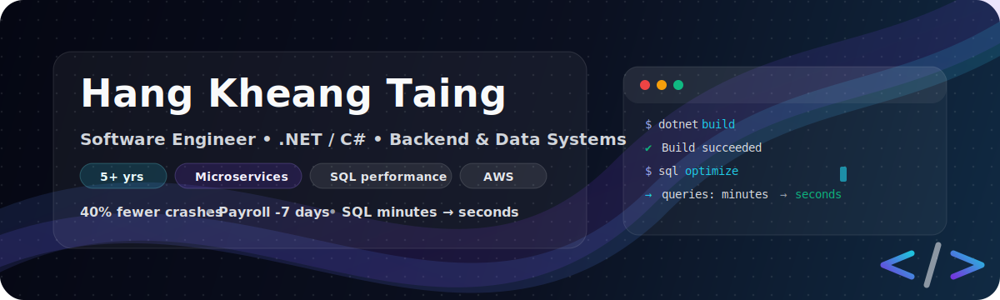
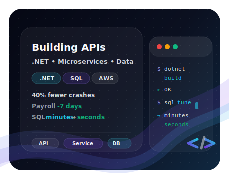

<!--
Profile README for GitHub
Note: Keep claims aligned with your resume.
-->

  <h2>Hang Kheang Taing (Kai)</h2>
  
<strong>Software Engineer</strong> • C# / .NET • Microservices • Event-driven Systems • SQL Optimization • AWS

  

    5+ years building scalable backend and full-stack systems across finance, ERP, e-commerce, and public-sector platforms. 
    Reduced system crashes by <strong>40%</strong>, cut payroll processing time by <strong>7 days</strong>, and optimized SQL pipelines from minutes to seconds.
  

  

    
    
    
    
  

  

    <a href="https://www.linkedin.com/in/hang-kheang-taing" target="_blank">LinkedIn</a> •
    <a href="mailto:hangkheangtaing@gmail.com">hangkheangtaing@gmail.com</a> •
    <a href="https://github.com/Kheang1409" target="_blank">GitHub</a> •
    <a href="https://kaitaing.netlify.app" target="_blank">Portfolio</a>
     
    <strong>Open to:</strong> Backend / Full-stack roles • .NET services • Cloud + data-heavy systems
  

---

##  Highlights

- **Impact shipped:** reduced crashes by **40%**, cut payroll processing by **7 days**, optimized SQL pipelines from minutes to seconds
- **What I build:** backend services, APIs, integrations, reporting pipelines, and workflow automation across finance/ERP/e-commerce
- **How I think:** performance + reliability first, clean design, pragmatic tradeoffs, measurable outcomes
- **How I work:** ownership end-to-end, clear communication, strong code reviews, mentoring, and documentation

---

##  About

  
  

    I build reliable services and APIs with a focus on performance, clarity, and maintainability.
    I enjoy turning messy legacy workflows into clean systems with measurable impact.
  

  <ul>
    <li><strong>Ownership:</strong> I take features from requirements → implementation → production support</li>
    <li><strong>Quality:</strong> I aim for simple designs, tests where they matter, and predictable deployments</li>
    <li><strong>Performance:</strong> I care about latency, throughput, and database efficiency (not just “it works”)</li>
    <li><strong>Collaboration:</strong> I write clear docs, review thoughtfully, and keep stakeholders aligned</li>
  </ul>

---

##  Core Skills

  
<strong>Expand core skills</strong>

 

**Backend & Architecture**

- C#, .NET, ASP.NET Core, Web API, REST, gRPC
- Microservices, event-driven systems, CQRS, Clean Architecture
- Background services, async/await, DI, middleware
- EF Core, Dapper • Redis • Kafka

**Databases**

- SQL Server, PostgreSQL, MySQL, MongoDB
- Query optimization, indexing, execution plan analysis
- Stored procedures, transactions

**Cloud & DevOps**

- AWS (EC2, Lambda, S3, RDS)
- Docker, Kubernetes
- CI/CD (GitHub Actions, GitLab CI)

**Frontend**

- JavaScript, TypeScript, Angular, React, Next.js, HTML, CSS, Tailwind

**Security & Testing**

- OAuth2, JWT, RBAC, CORS, HTTPS/TLS
- xUnit, NUnit, Moq • unit & integration testing

---

##  Technologies (quick glance)

  

---

##  Experience

**Senior Software Engineer — Sahakrinpheap Microfinance PLC (Sep 2021 – May 2024)**

- Designed and automated biometric attendance services, reducing payroll processing time by **7 days**.
- Consolidated multiple legacy banking plugins into a single system, cutting crashes by **40%** and saving **20+ maintenance hours/month**.
- Implemented real-time Telegram Bot alerts for system incidents, improving response time by **50%** and maintaining **99% uptime**.
- Optimized SQL reporting pipelines, reducing execution time from minutes to **under 2 seconds**.
- Strengthened application security with authentication and CORS policies, passing internal audits with **zero unauthorized access incidents**.
- Mentored junior developers through code reviews and architecture discussions, reducing onboarding time by **30%**.

**Full-Stack Engineer — Pathmazing Inc (Mar 2021 – Sep 2021)**

- Built and maintained Python-based REST APIs and custom Odoo ERP integrations, improving operational workflows and user satisfaction.
- Integrated Microsoft Teams with Odoo, increasing meeting adoption by **35%** and saving **10+ hours/week** in manual coordination.
- Contributed to the Odoo **13 → 14** upgrade, improving performance by **20%**, eliminating data duplication, and optimizing multiple modules.
- Integrated ABA PayWay payment gateway, increasing transaction reliability by **30%** for **1,000+ monthly payments**.
- Collaborated on the Khmer Care fundraising platform, contributing to fundraising totaling **$70.8K** across **30+** partner organizations.
- Optimized Firearms Metrics Platform, reducing reporting time from **30 minutes** to **under 5 minutes** for **200+ users**.

**Application Developer — Anakut Digital Solution, Co. Ltd (Oct 2020 – May 2021)**

- Developed a POS system with automated inventory and scale integration, eliminating **99%** of manual entry errors.
- Built a Hotel Management System with booking engine, reducing check-in time by **50%** and increasing booking efficiency by **30%**.
- Delivered a Clinic Management System with scheduling and notifications, reducing patient wait times by **45%**.
- Configured Odoo ERP for e-commerce operations, enabling real-time order tracking and improving customer retention by **15%**.

---

##  Side Projects & Personal Engineering Work

- **AI-Powered Portfolio** — Improved navigation and user flow based on feedback, increasing session duration by **35%** for **150+ weekly users**.
- **Angkor Milk Meal Reporting App** — Collaborated with **500+ users** to optimize reporting queries, delivering faster insights within **2 days**.

---

##  Education

- **M.S. Computer Science** — Maharishi International University (May 2024 – Dec 2026)
- **B.S. Computer Science** — Royal University of Phnom Penh (Nov 2016 – Nov 2020)

---

##  Honors

- **Khmer Care** — Best Project & Team Effort of The Year @ Pathmazing Inc (06/2021)

---

##  GitHub

  <table align="center">
  <tr border="0">
  <td width="50%" align="center">
    
  
    
  
  </td>

  <td width="50%" align="center">
  
  </td>
  </tr>
</table>

  <!-- Note: main endpoint can 503; using a community load-balancing endpoint. -->
  

  

---

##  Let's Connect

💬 Always open to discussions about backend systems, cloud architecture, and scaling legacy applications.
Reach me via [LinkedIn](https://www.linkedin.com/in/hang-kheang-taing), [GitHub](https://github.com/Kheang1409), or [Portfolio](https://kaitaing.netlify.app).
