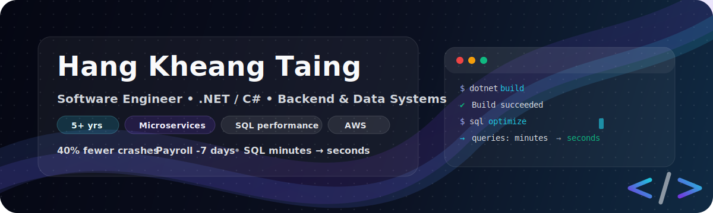
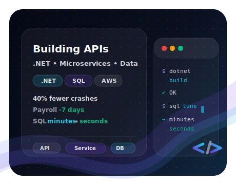

<!--
Profile README for GitHub
Note: Keep claims aligned with your resume.
-->

  <h2>Hang Kheang Taing (Kai)</h2>
  
<strong>Software Engineer</strong>

  
C# / .NET Core • Microservices • Event-Driven Systems • Cloud (AWS / Azure) • SQL Performance

  
<em>Work Authorization: Authorized to work in the U.S. without current or future employer sponsorship</em>

  

    
    
    
    
    
  

  

    641-233-0129 •
    <a href="https://www.linkedin.com/in/hang-kheang-taing" target="_blank">LinkedIn</a> •
    <a href="mailto:hangkheangtaing@gmail.com">Email</a> •
    <a href="https://github.com/Kheang1409" target="_blank">GitHub</a> •
    <a href="https://kaitaing.netlify.app" target="_blank">Portfolio</a>
  

---

##  About

  

Software Engineer with **5+ years** of experience building scalable backend systems and distributed applications using **C#**, **.NET Core**, and cloud platforms (**AWS**, **Azure**).

Strong expertise in **RESTful API development**, **database optimization**, and **microservices architecture**. Proven ability to modernize legacy systems, improve performance, and deliver reliable, secure applications in production environments.

**Focus Areas**

- Backend systems and APIs that scale under production load
- Data performance tuning and query optimization
- Cloud-native services, reliability, and security

---

##  Skills

- **Languages & Frameworks:** C#, .NET Core, ASP.NET Core, JavaScript, TypeScript
- **Backend & Architecture:** REST APIs, Microservices, Event-Driven Architecture, CQRS, Clean Architecture, Dependency Injection, Kafka, Redis, SignalR
- **Databases:** SQL Server, PostgreSQL, MongoDB, Entity Framework Core, Dapper, Query Optimization, Indexing
- **Cloud & DevOps:** AWS (EC2, S3, RDS, Lambda), Azure (App Services, Functions), Docker, Kubernetes, CI/CD (GitHub Actions, Azure DevOps)
- **Frontend:** React, Angular, Next.js, HTML5, CSS3
- **Security:** OAuth2, JWT, RBAC
- **Core:** OOP, SOLID, Secure API Design, Agile/Scrum

---

##  Tech Stack

  

---

##  Experience

<strong>Software Engineer — Better &amp; Best Inc.</strong> <em>(Apr 2026 – Present | Oregon, WI, USA)</em>

 

- Design and develop backend services and internal applications supporting POS, billing, and order management systems
- Build RESTful APIs enabling real-time data processing and system integration across operational workflows
- Optimize database queries and schema design, improving response time and system reliability under daily transaction loads
- Refactor legacy components into modular, scalable services to improve maintainability and extensibility
- Troubleshoot and resolve production issues, ensuring high availability and system stability
- Collaborate with stakeholders to translate business requirements into scalable technical solutions

<strong>Software Engineer — Sahakrinpheap Microfinance PLC</strong> <em>(Sep 2021 – May 2024 | Phnom Penh, Cambodia)</em>

 

- Re-architected legacy banking systems into scalable microservices using C# and ASP.NET Core, developing RESTful APIs and reducing system crashes by **40%** while improving maintainability
- Built and maintained event-driven monitoring and alerting systems on Azure, improving incident response time by **50%** and achieving **99% uptime**
- Optimized SQL Server and PostgreSQL databases by refining complex queries, stored procedures, and indexing strategies, reducing execution time from minutes to **2 seconds**
- Designed and developed backend services for payroll and attendance systems, automating workflows and reducing processing time by **7 days**
- Implemented secure authentication and authorization using OAuth2, JWT, and RBAC, ensuring compliance and zero unauthorized access incidents
- Diagnosed and resolved production issues through debugging and performance analysis, improving system stability and reducing downtime
- Collaborated with architects, QA, and DevOps in Agile sprints, using Jira for sprint planning and GitHub Actions for CI/CD pipelines, which shortened release cycles by **15%** and increased deployment frequency
- Mentored engineers on backend development and system design, reducing onboarding time by **30%** and improving team productivity

<strong>Software Engineer — Pathmazing Inc</strong> <em>(Mar 2021 – Sep 2021 | Phnom Penh, Cambodia)</em>

 

- Designed and integrated secure RESTful APIs with third-party payment systems, improving transaction reliability by **30%** and enabling seamless system integrations
- Developed and maintained backend services using C# and .NET, supporting ERP integrations and reducing manual operational workflows
- Optimized SQL queries and database performance, improving system efficiency by **20%** and resolving data inconsistencies
- Improved reporting pipelines by redesigning data processing logic, reducing execution time from **30 minutes** to a few minutes
- Provided debugging and troubleshooting for production systems using Azure Monitor logs and Kubernetes health checks, which kept system reliability high and reduced issue-resolution time

<strong>Software Engineer — Anakut Digital Solution, Co. Ltd</strong> <em>(Oct 2020 – May 2021 | Phnom Penh, Cambodia)</em>

 

- Developed scalable backend systems for POS and management platforms, reducing manual data entry errors by **99%**
- Built and maintained RESTful APIs for ERP-integrated systems, enabling real-time data tracking and reporting
- Designed scheduling and booking services, improving system efficiency and reducing processing time by **50%**
- Implemented real-time communication features using SignalR, improving user responsiveness by **45%**
- Applied modular architecture and design patterns in ASP.NET Core projects, ensuring maintainable and scalable codebases that reduced future development effort

<strong>Software Engineer — Arrow Dot</strong> <em>(Oct 2019 – Oct 2020 | Phnom Penh, Cambodia)</em>

 

- Developed and deployed web applications using CI/CD pipelines, Docker, and Kubernetes, improving deployment reliability and reducing manual release effort
- Built and maintained backend services and APIs, improving database performance and overall system efficiency by **30%**
- Collaborated with development teams through Git pull-request workflows, conducting code reviews and managing feature branches, which streamlined version control and reduced integration conflicts

---

##  Projects

- **AI-Powered Portfolio** — Integrated LLM APIs to generate dynamic content, increasing user engagement by **35%** for **150+ weekly users**
- **Angkor Milk Meal App** — Optimized SQL queries and reporting features, improving performance and usability for **500+ users**

---

##  Education

| Degree                    | Institution                        | Timeline            | Location             |
| ------------------------- | ---------------------------------- | ------------------- | -------------------- |
| **M.S. Computer Science** | Maharishi International University | May 2024 – Dec 2026 | Fairfield, IA, USA   |
| **B.S. Computer Science** | Royal University of Phnom Penh     | Nov 2016 – Nov 2020 | Phnom Penh, Cambodia |

---

##  Honors

- **Best Project & Team Effort of The Year** — Khmer Care @ Pathmazing Inc (06/2021)

---

##  GitHub Stats

<table align="center">
  <tr>
    <td align="center">
      
       
      
       
      
    </td>
    <td align="center">
      
       
      
    </td>
  </tr>
</table>

---

##  Let's Connect

Open to discussions about backend systems, cloud architecture, and scaling legacy applications.

  
  
  
  

